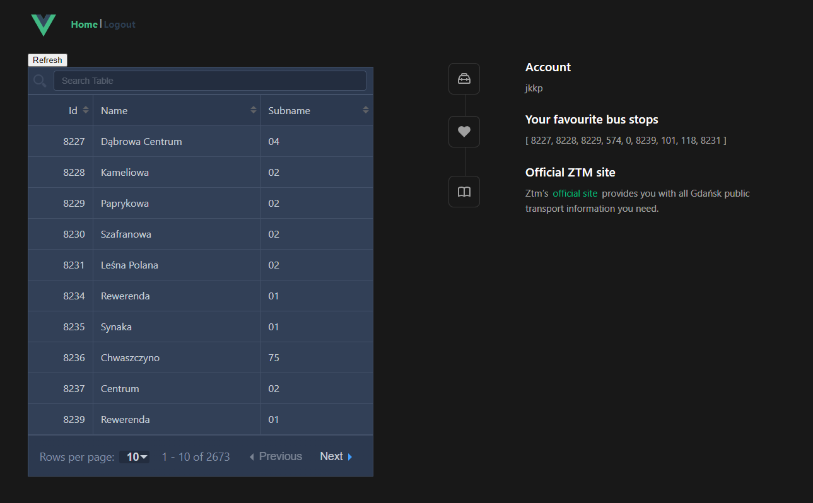

# A task for the forth laboratories of Implementation of web applications (17.12.2023)

The solution contains an ASP.NET Api backend and Vue.js frontend.

# Backend offers:
- Gdansk ZTM's stops details list,
- Gdansk ZTM's details for a specified stop,
- Gdansk ZTM's delays for a specified stop,
- User registration/login/deletion,
- List of favourite stops of the user,
- List of favourite stops of the user with their delays,
- Adding and deleting favourite stops,
- JWT Bearer authorization.

# Frontend offers:
- Searchable, sortable and selectable list of all stops,
- Details of the selected stop,
- Delays of the selected stop,
- Basic user login and registration,
- Favourite stops of the user,
- Addition or deletion to/from the favourites of the selected stop
- JWT Bearer User Token

